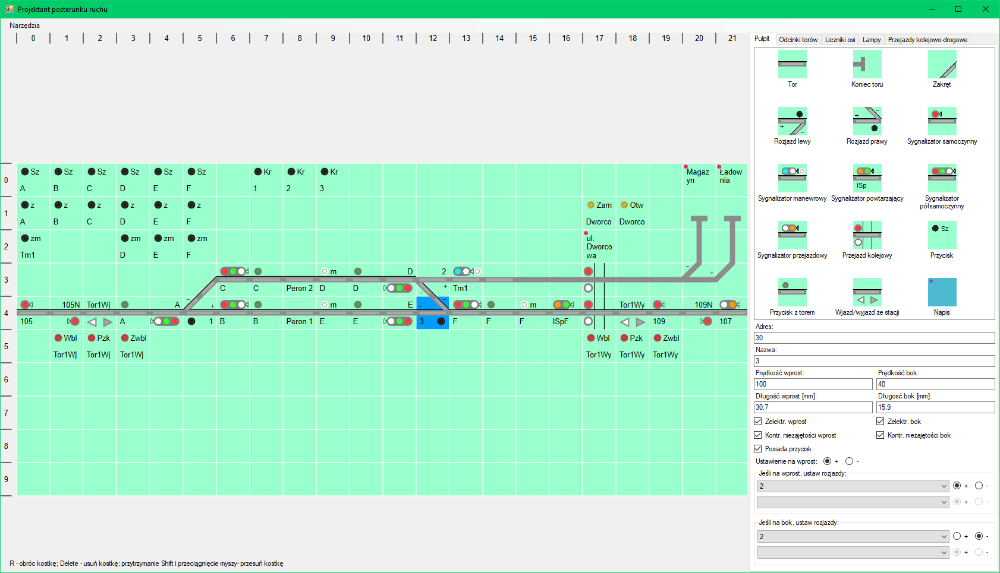

# System sterowania ruchem kolejowym
Program służy do sterowania ruchem kolejowym na makiecie.
Posiada moduły służące do:
- projektowania kompletnego pulpitu sterującego dla posterunku ruchu,
- definiowania połączeń między posterunkami ruchu,
- komunikacji z urządzeniami,
- zarządzania ruchem i zależnościami na całej sieci kolejowej,
- zmiany i wyświetlania stanu urządzeń (jak zwrotnice, sygnalizacja, niezajętość torów itd.),
- zarządzania i sterowania pociągami,
- sterowania oświetleniem na makiecie.
Zarządzanie ruchem odbywa się na serwerze w sposób scentralizowany. Każdy klient może wybrać do sterowania dowolną liczbę dostępnych posterunków, dzięki czemu całość sieci może być sterowana i nadzorowana z jednego miejsca, jak również każdy posterunek może być sterowany przez różne osoby/zespoły osób.

## Projektowanie posterunków ruchu
