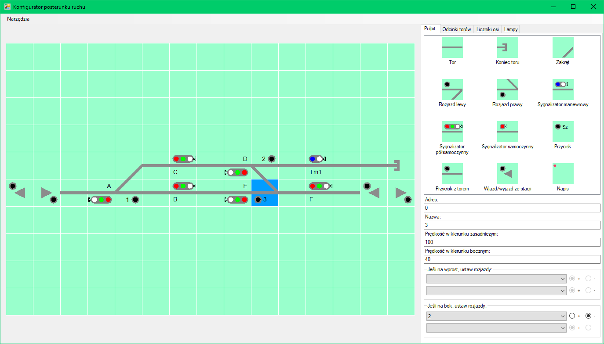

# System sterowania ruchem kolejowym
Program służący do tworzenia schematów posterunków ruchu oraz sterowania ruchem na makiecie kolejowej - pzełączania zwrotnic, ustawiania sygnałów oraz wykrywania zajętości torów.

## Tworzenie schematów stacji
